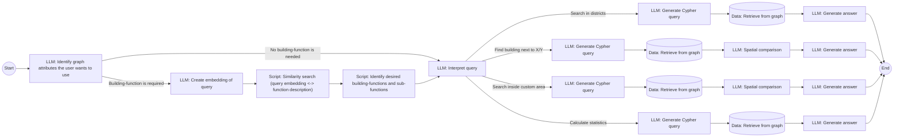

# Description of AX_Ploration

## Agent architecture

```mermaid
flowchart LR
  Start((Start)) --> Attr[LLM: Identify graph attributes the user wants to use]

  Attr -->|No building-function is needed| Interpret[LLM: Interpret query]
  Attr -->|Building-function is required| Embed[LLM: Create embedding of query]
  Embed --> SimSearch["Script: Similarity search (query embedding <-> function description)"]
  SimSearch --> PickFuncs[Script: Identify desired building-functions and sub-functions]
  PickFuncs --> Interpret

  Interpret -->|Search in districts| Cy1[LLM: Generate Cypher query]
  Interpret -->|Find building next to X/Y| Cy2[LLM: Generate Cypher query]
  Interpret -->|Search inside custom area| Cy3[LLM: Generate Cypher query]
  Interpret -->|Calculate statistics| Cy4[LLM: Generate Cypher query]

  Cy1 --> D1[(Data: Retrieve from graph)] --> Ans1[LLM: Generate answer] --> End((End))

  Cy2 --> D2[(Data: Retrieve from graph)] --> Sp2[LLM: Spatial comparison] --> Ans2[LLM: Generate answer] --> End
  Cy3 --> D3[(Data: Retrieve from graph)] --> Sp3[LLM: Spatial comparison] --> Ans3[LLM: Generate answer] --> End

  Cy4 --> D4[(Data: Retrieve from graph)] --> Ans4[LLM: Generate answer] --> End
```