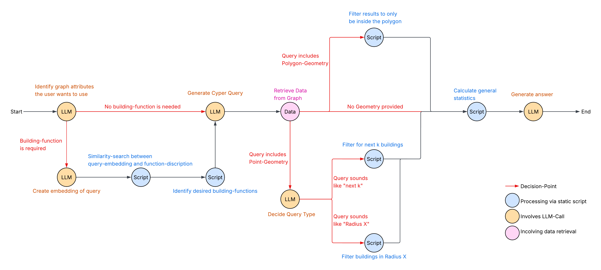
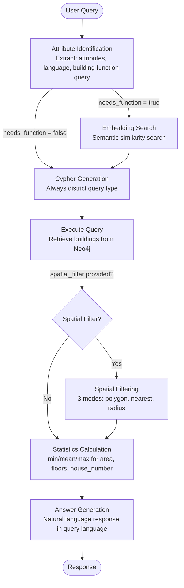

# AX_Ploration Backend - Scripts Documentation

> **Natural Language Query System for Berlin ALKIS Building Data**
> 
> LangGraph-based agent workflow that transforms natural language queries into Neo4j Cypher queries, with multi-language support, spatial filtering, and automated statistics calculation.

---

## Table of Contents

- [Overview](#overview)
- [Architecture](#architecture)
- [Installation](#installation)
- [Database Schema](#database-schema)
- [Agent Workflow](#agent-workflow)
- [Project Structure](#project-structure)
- [Configuration](#configuration)
- [Usage](#usage)
- [Core Components](#core-components)
- [Utilities](#utilities)
- [Development](#development)
- [Troubleshooting](#troubleshooting)

---

## Overview

The AX_Ploration backend scripts implement an intelligent agent system for querying Berlin's ALKIS building dataset. The system:

- **Understands Natural Language**: Processes queries in any language (German, English, French, etc.)
- **Semantic Search**: Uses embeddings to find relevant building functions (e.g., "Wohngebäude", "hospitals")
- **Spatial Filtering**: Supports three modes - polygon containment, nearest X buildings, radius-based search
- **Automated Statistics**: Calculates min/mean/max for area, floors, and house numbers
- **LangGraph Orchestration**: State machine workflow for reliable multi-step processing

### Key Features

- Multi-language query processing with automatic language detection  
- Vector similarity search for building function matching  
- Client-side spatial filtering with Shapely (3 modes)  
- Mandatory statistics calculation before answer generation  
- Consistent result structure: `[{"buildings": [...], "statistics": {...}}]`  
- Server-Sent Events (SSE) streaming for real-time progress updates  
- Neo4j Aura database with 96,572 buildings, 234 functions, 12 districts  

---

## Architecture

### Agent Architecture Diagram



### Current Workflow (Simplified)



### Design Decisions

1. **No Query Type Classification**: Eliminated `interpret_query` node - always use district queries
2. **Mandatory Statistics**: All queries calculate statistics before answer generation
3. **Client-Side Spatial Filtering**: Shapely handles all spatial operations (Neo4j Aura lacks spatial functions)
4. **Building Function Extraction**: Separate extraction for better embedding precision
5. **Language Agnostic**: LLM determines language dynamically (no fixed mapping)

---

## Installation

### Prerequisites

- **Python 3.11+**
- **Neo4j Aura** account (or local Neo4j 5.x instance)
- **OpenAI API Key** (for GPT-4o and embeddings)
- **Berlin ALKIS Dataset** loaded into Neo4j

### Quick Start

1. **Install dependencies**:
   ```bash
   pip install -r requirements.txt
   ```

2. **Configure environment** (see [Configuration](#configuration)):
   ```bash
   cp .env.example .env
   # Edit .env with your credentials
   ```

3. **Verify setup**:
   ```bash
   python -m backend.scripts.main "Test query" --verbose
   ```

### Dependencies

```
# Core
neo4j>=5.13.0           # Neo4j database driver
openai>=1.3.0           # OpenAI API client
python-dotenv>=1.0.0    # Environment configuration

# LangChain Ecosystem
langchain>=0.1.0        # LangChain framework
langgraph>=0.0.1        # State machine workflow
langsmith>=0.1.0        # Tracing (optional)

# Spatial & Data
shapely>=2.0.0          # Spatial operations
beautifulsoup4>=4.12.0  # HTML parsing (schema extraction)

# API (for server.py)
fastapi>=0.128.0        # REST API framework
uvicorn>=0.40.0         # ASGI server
pydantic>=2.0.0         # Data validation
```

---

## Database Schema

### Neo4j Structure

The database contains Berlin ALKIS building data with the following schema:

#### Node Labels

**Building** (96,572 nodes)
```cypher
Properties:
  id: String              # "DEBE00YY11100066"
  centroid: String        # WKT Point (EPSG:25833)
  floors_above: Integer   # Number of floors above ground
  house_number: String    # "12a", "4", etc.
  street_name: String     # "Alter Wiesenweg 113"
  geometry_geojson: String # WKT MultiPolygon (EPSG:25833)
  area: String            # "198.06" (decimal as string)
```

**Function** (234 nodes)
```cypher
Properties:
  code: Integer           # 1000, 1010, 2000, etc.
  name: String            # "Wohngebäude", "Wohnhaus"
  description: String     # Full function description
  description_embedding_small: List<Float>   # OpenAI text-embedding-3-small
  description_embedding_large: List<Float>   # (optional) larger model
```

**District** (12 nodes)
```cypher
Properties:
  municipality_name: String   # "Mitte", "Pankow", "Charlottenburg-Wilmersdorf"
  municipality_key: String
  state_name: String          # "Berlin"
  wkt: String                 # WKT Polygon (district boundary)
  centroid: String            # WKT Point
  gml_id: String
```

#### Relationships

**LOCATED_IN**
```cypher
(Building)-[:LOCATED_IN]->(District)
```

**HAS_FUNCTION**
```cypher
(Building)-[:HAS_FUNCTION]->(Function)
```

### Berlin Districts

The database covers these 12 Berlin districts:
- Mitte
- Friedrichshain-Kreuzberg
- Pankow

### Important Constraints

- **Coordinate System**: All geometries use **EPSG:25833** (ETRS89/UTM Zone 33N), NOT WGS84  
- **WKT Strings**: Geometries stored as WKT strings (Neo4j Aura lacks spatial point type support)  
- **Client-Side Spatial**: All spatial operations (containment, distance) happen in Python with Shapely  
- **Area Format**: Building area stored as string with "." decimal separator (e.g., "198.06")  
- **House Numbers**: May contain letters (e.g., "12a") - numeric extraction required for statistics  

---

## Agent Workflow

### Node Execution Sequence

The agent follows a fixed pipeline with conditional branches:

```
START
  ↓
[1] identify_attributes
  ↓
  ├── needs_function = true  → [2] embedding_search
  └── needs_function = false → [3] generate_cypher_district
                                     ↓
[3] generate_cypher_district (always district query type)
  ↓
[4] execute_query (retrieve buildings from Neo4j)
  ↓
  ├── spatial_filter provided? → [5] spatial_filtering
  └── no spatial_filter        → [6] statistics_calculation
                                       ↓
[6] statistics_calculation (mandatory for all queries)
  ↓
[7] generate_answer (language-aware response)
  ↓
END
```

### Node Descriptions

#### 1. Attribute Identification
**File**: `nodes/attribute_identification.py`

**Purpose**: Analyze query to extract three key pieces of information:

1. **Attributes**: Which building properties to return (e.g., `["area", "floors_above", "street_name"]`)
2. **Building Function Query**: Extract ONLY function-relevant terms (e.g., "Schulen" from "Wie viele Schulen in Pankow?")
3. **Query Language**: Full language name for response generation (e.g., "German", "English", "French")

**Input**: `query` (user's natural language query)

**Output**:
```python
{
    "attributes": ["area", "floors_above"],
    "needs_building_function": True,
    "building_function_query": "Schulen",
    "query_language": "German"
}
```

**Example Transformations**:
- "Wie viele Schulen gibt es in Pankow?" → building_function_query: "Schulen"
- "Show me hospitals with more than 5 floors" → building_function_query: "hospitals", language: "English"
- "Liste alle Gebäude auf" → needs_building_function: False

---

#### 2. Embedding Search (Conditional)
**File**: `nodes/embedding_search.py`

**Purpose**: Semantic search for building functions using vector similarity

**Execution Condition**: `needs_building_function == True`

**Process**:
1. Create embedding from `building_function_query` (NOT full query)
2. Query Neo4j vector index `function_embeddings_small`
3. Return top 5 matching functions with similarity scores
4. Fallback to keyword matching if vector index unavailable

**Input**: `building_function_query` (e.g., "Schulen")

**Output**:
```python
{
    "building_functions": [1310, 1320],
    "building_function_names": ["Schule", "Schulgebäude"],
    "building_function_descriptions": ["Gebäude für Bildungszwecke", ...]
}
```

**Why Separate Query?**: Using only "Schulen" instead of "Wie viele Schulen gibt es in Pankow?" improves embedding similarity by removing location/filter context.

---

#### 3. Cypher Generation
**File**: `nodes/cypher_generation.py`

**Purpose**: Generate Neo4j Cypher query to retrieve buildings

**Query Type**: Always "district" (statistics query type removed)

**Input**:
- `query`: Original user query
- `attributes`: List of attributes to return
- `building_functions`: Function codes (if applicable)

**Output**:
```python
{
    "cypher_query": "MATCH (b:Building)-[:HAS_FUNCTION]->(f:Function) WHERE f.code IN [1310, 1320] AND ...",
    "messages": ["Generated Cypher query for district search"]
}
```

**Example Cypher**:
```cypher
MATCH (b:Building)-[:LOCATED_IN]->(d:District)
WHERE d.municipality_name = 'Pankow'
OPTIONAL MATCH (b)-[:HAS_FUNCTION]->(f:Function)
WHERE f.code IN [1310, 1320]
RETURN b.id AS id,
       b.street_name AS street_name,
       b.area AS area,
       b.floors_above AS floors_above,
       b.house_number AS house_number,
       b.centroid AS centroid,
       b.geometry_geojson AS geometry_geojson,
       f.code AS function_code,
       f.name AS function_name
```

---

#### 4. Execute Query
**File**: `nodes/data_retrieval.py`

**Purpose**: Execute Cypher query against Neo4j and structure results

**Process**:
1. Execute query via `neo4j_client.execute_query()`
2. Check if results already structured as `[{"buildings": [...]}]`
3. If plain list, wrap as `[{"buildings": results}]`
4. Return consistent structure

**Output**:
```python
{
    "results": [
        {
            "buildings": [
                {
                    "id": "DEBE00YY11100066",
                    "street_name": "Hauptstraße 12",
                    "area": "198.06",
                    "floors_above": 3,
                    "house_number": "12",
                    "centroid": "POINT(388500 5819500)",
                    "geometry_geojson": "{\"type\": \"MultiPolygon\", ...}"
                },
                ...
            ]
        }
    ]
}
```

**Error Handling**: Returns `[{"buildings": []}]` on query failure

---

#### 5. Spatial Filtering (Conditional)
**File**: `nodes/spatial_filtering.py`

**Purpose**: Client-side spatial filtering with three modes

**Execution Condition**: `spatial_filter` (WKT geometry) is provided

**Three Filtering Modes**:

**Mode 1: Polygon Containment**
```python
# Input: spatial_filter = "POLYGON((x1 y1, x2 y2, ...))"
# Process: Filter buildings whose centroids are within polygon
# Output: Buildings inside polygon boundary
```

**Mode 2: Nearest X Buildings**
```python
# Input: spatial_filter = "POINT(x y)", query = "5 nächsten Schulen"
# Process: LLM determines count, sort by distance, take top X
# Output: X nearest buildings with distance metadata
```

**Mode 3: Radius Search**
```python
# Input: spatial_filter = "POINT(x y)", query = "im Umkreis von 500m"
# Process: LLM extracts radius, filter by distance threshold
# Output: Buildings within radius, sorted by distance
```

**How Mode is Determined**:
- LLM analyzes query to detect "nearest X" vs "radius X" intent
- Prompt: `PROMPTS["spatial_filter_mode"]`
- Default: "nearest 10" if unclear

**Output**:
```python
{
    "results": [{"buildings": [...]}],  # Filtered buildings
    "spatial_comparison": {
        "mode": "nearest",
        "count": 5,
        "original_count": 142,
        "filtered_count": 5,
        "reasoning": "User requested 5 nearest buildings"
    }
}
```

**Coordinate System**: All WKT must be in EPSG:25833 (not WGS84!)

---

#### 6. Statistics Calculation (Mandatory)
**File**: `nodes/statistics_calculation.py`

**Purpose**: Calculate descriptive statistics for all building results

**Execution**: ALWAYS runs before answer generation (no conditional)

**Calculated Statistics**:
```python
{
    "area_min": 123.45,        # Minimum building area (m²)
    "area_max": 2345.67,       # Maximum building area
    "area_mean": 789.12,       # Average building area
    "floors_above_min": 1,     # Minimum floor count
    "floors_above_max": 12,    # Maximum floor count
    "floors_above_mean": 4.2,  # Average floor count
    "house_number_min": 1,     # Minimum house number (numeric part)
    "house_number_max": 150,   # Maximum house number
    "building_count": 42       # Total number of buildings
}
```

**Data Type Handling**:
- **Area**: Parse string with "." decimal separator → `float("198.06")`
- **Floors**: Integer values
- **House Number**: Extract numeric part with regex (`"12a"` → `12`)

**Output Structure**:
```python
{
    "results": [
        {
            "buildings": [...],
            "statistics": {
                "area_min": 123.45,
                ...
            }
        }
    ]
}
```

**Edge Cases**:
- Missing values: Filtered out before calculation
- Empty results: Returns `{"building_count": 0}`
- Invalid house numbers (e.g., "abc"): Skipped for min/max calculation

---

#### 7. Answer Generation
**File**: `nodes/answer_generation.py`

**Purpose**: Generate natural language answer in detected query language

**Input**:
- `query`: Original query
- `results`: Buildings with statistics
- `spatial_comparison`: Spatial filter metadata (if applicable)
- `query_language`: Full language name (e.g., "German", "English")

**Process**:
1. Format results as JSON (limit to 20 buildings for token efficiency)
2. Add building function context if used
3. Add spatial filtering description if applicable
4. Send to GPT-4o with language-specific prompt
5. Return formatted answer

**Example Outputs**:

**German Query**: "Wie viele Schulen gibt es in Pankow?"
```
In Pankow wurden 23 Schulgebäude gefunden. Die durchschnittliche Fläche beträgt 1.234 m², 
mit einem Minimum von 456 m² und einem Maximum von 3.456 m². Die Gebäude haben zwischen 
1 und 5 Stockwerken über dem Erdgeschoss.
```

**English Query**: "Show me hospitals with more than 5 floors"
```
Found 8 hospital buildings with more than 5 floors. The average area is 2,345 m², 
ranging from 1,234 m² to 4,567 m². Floor counts range from 6 to 12 stories.
```

**Language Support**: Universal - any language GPT-4o can detect and generate

---

## Project Structure

```
backend/
├── api/
│   └── server.py                       # FastAPI REST API with SSE streaming
├── db/
│   └── generate_schema_template.py     # Export Neo4j schema for prompts
├── scripts/                            # Core agent system
│   ├── __init__.py
│   ├── config.py                       # Environment configuration
│   ├── models.py                       # AgentState TypedDict
│   ├── graph.py                        # LangGraph workflow definition
│   ├── main.py                         # CLI entry point
│   ├── nodes/                          # Workflow nodes
│   │   ├── __init__.py
│   │   ├── attribute_identification.py # Extract attributes, language, function query
│   │   ├── embedding_search.py         # Semantic function search
│   │   ├── cypher_generation.py        # Generate Cypher queries (district only)
│   │   ├── data_retrieval.py           # Execute queries against Neo4j
│   │   ├── spatial_filtering.py        # Client-side spatial filtering (3 modes)
│   │   ├── statistics_calculation.py   # Calculate building statistics (mandatory)
│   │   ├── answer_generation.py        # Generate language-aware answers
│   │   └── routing.py                  # Conditional edge routing functions
│   └── utils/                          # Shared utilities
│       ├── __init__.py
│       ├── neo4j_client.py             # Neo4j database client (singleton)
│       ├── llm_client.py               # OpenAI API client (singleton)
│       ├── prompts.py                  # Centralized LLM prompts
│       └── schema_template.py          # Database schema for LLM context
├── agent-architecture-new.png          # Architecture diagram
└── README.md                           # This file
```

---

## Configuration

### Environment Variables

Create a `.env` file in the project root:

```bash
# Required - OpenAI
OPENAI_API_KEY=sk-...                  # Your OpenAI API key
OPENAI_MODEL=gpt-4o                    # GPT model (default: gpt-4o)
OPENAI_EMBEDDING_MODEL=text-embedding-3-small  # Embedding model

# Required - Neo4j
NEO4J_URI=neo4j+s://xxxxx.databases.neo4j.io  # Neo4j Aura URI
NEO4J_USERNAME=neo4j                   # Neo4j username (default: neo4j)
NEO4J_PASSWORD=your_password_here      # Neo4j password
NEO4J_DATABASE=neo4j                   # Database name (default: neo4j)

# Optional - LangSmith Tracing
LANGSMITH_API_KEY=lsv2_pt_...          # LangSmith API key (optional)
LANGSMITH_PROJECT=ax_ploration         # Project name for tracing

# Optional - API Configuration
API_PORT=8000                          # API server port (default: 8000)
API_HOST=localhost                     # API server host (default: localhost)
```

### Configuration Validation

The system validates required environment variables on startup:

```python
from backend.scripts.config import validate_config

try:
    validate_config()
    print("Configuration valid")
except ValueError as e:
    print(f"Missing config: {e}")
```

**Required Variables**:
- `OPENAI_API_KEY`
- `NEO4J_URI`
- `NEO4J_PASSWORD`

**Optional Features**:
- LangSmith tracing (if `LANGSMITH_API_KEY` set)
- Custom model selection
- API host/port configuration

---

## Usage

### Command Line Interface

#### Basic Query
```bash
python -m backend.scripts.main "Zeige mir alle Schulen in Pankow"
```

#### Verbose Mode (Debug)
```bash
python -m backend.scripts.main "Show me hospitals" --verbose
```

#### With Spatial Filter
```python
# Note: CLI doesn't support spatial_filter parameter directly
# Use Python API or REST API for spatial filtering
```

### Python API

#### Basic Query
```python
from backend.scripts.graph import graph
from backend.scripts.main import create_initial_state

# Create initial state
state = create_initial_state(query="Wie viele Wohngebäude gibt es in Mitte?")

# Run agent
final_state = graph.invoke(state)

# Access results
print(final_state["final_answer"])
print(f"Found {len(final_state['results'][0]['buildings'])} buildings")
print(f"Statistics: {final_state['results'][0]['statistics']}")
```

#### With Spatial Filter
```python
# Polygon containment
spatial_filter = "POLYGON((388000 5819000, 389000 5819000, 389000 5820000, 388000 5820000, 388000 5819000))"
state = create_initial_state(
    query="Alle Gebäude in diesem Bereich",
    spatial_filter=spatial_filter
)
final_state = graph.invoke(state)

# Nearest X buildings
spatial_filter = "POINT(388500 5819500)"
state = create_initial_state(
    query="Die 5 nächsten Krankenhäuser",
    spatial_filter=spatial_filter
)
final_state = graph.invoke(state)

# Radius search
spatial_filter = "POINT(388500 5819500)"
state = create_initial_state(
    query="Alle Gebäude im Umkreis von 500m",
    spatial_filter=spatial_filter
)
final_state = graph.invoke(state)
```

#### Streaming Execution
```python
# Stream intermediate states
for step_state in graph.stream(state):
    node_name = list(step_state.keys())[0]
    node_output = step_state[node_name]
    print(f"Node: {node_name}")
    print(f"Messages: {node_output.get('messages', [])}")
```

### REST API

See [API README](api/README.md) for HTTP endpoint documentation.

**Quick Example**:
```bash
curl -X POST http://localhost:8000/query \
  -H "Content-Type: application/json" \
  -d '{
    "query": "Zeige mir alle Schulen in Pankow",
    "stream": true
  }'
```

---

## Core Components

### AgentState

**File**: `models.py`

Central state object passed through the workflow:

```python
class AgentState(TypedDict):
    # Input
    query: str                                    # User's natural language query
    spatial_filter: Optional[str]                 # WKT geometry (EPSG:25833)
    query_language: Optional[str]                 # "German", "English", etc.
    
    # Attribute Identification
    attributes: List[str]                         # ["area", "floors_above", ...]
    needs_building_function: bool                 # True if function lookup needed
    building_function_query: Optional[str]        # "Schulen" (extracted terms)
    
    # Building Function Search
    building_functions: List[int]                 # [1310, 1320]
    building_function_names: List[str]            # ["Schule", "Schulgebäude"]
    building_function_descriptions: List[str]     # Full descriptions
    
    # Cypher Generation
    cypher_query: str                             # Generated Cypher query
    
    # Data Retrieval & Statistics
    results: List[Dict[str, Any]]                 # [{"buildings": [...], "statistics": {...}}]
    
    # Spatial Processing
    spatial_comparison: Optional[Dict[str, Any]]  # Spatial filter metadata
    
    # Output
    final_answer: str                             # Natural language response
    
    # Error Handling
    error: Optional[str]                          # Error message if failed
    
    # Metadata
    messages: Annotated[List[str], add]           # Log of processing steps
```

### Graph Compilation

**File**: `graph.py`

```python
from langgraph.graph import StateGraph, START, END

def create_workflow() -> StateGraph:
    workflow = StateGraph(AgentState)
    
    # Add nodes
    workflow.add_node("identify_attributes", identify_attributes)
    workflow.add_node("embedding_search", embedding_search)
    workflow.add_node("generate_cypher_district", generate_cypher_district)
    workflow.add_node("execute_query", execute_query)
    workflow.add_node("spatial_filtering", spatial_filtering)
    workflow.add_node("statistics_calculation", statistics_calculation)
    workflow.add_node("generate_answer", generate_answer)
    
    # Define edges
    workflow.add_edge(START, "identify_attributes")
    workflow.add_conditional_edges("identify_attributes", route_function_needed)
    workflow.add_edge("embedding_search", "generate_cypher_district")
    workflow.add_edge("generate_cypher_district", "execute_query")
    workflow.add_conditional_edges("execute_query", route_spatial_filter_needed)
    workflow.add_edge("spatial_filtering", "statistics_calculation")
    workflow.add_edge("statistics_calculation", "generate_answer")
    workflow.add_edge("generate_answer", END)
    
    return workflow

# Pre-compiled graph
graph = compile_graph()
```

---

## Utilities

### Neo4j Client

**File**: `utils/neo4j_client.py`

Singleton client for Neo4j operations:

```python
from backend.scripts.utils.neo4j_client import neo4j_client

# Execute Cypher query
results = neo4j_client.execute_query(
    "MATCH (b:Building) RETURN b LIMIT 10",
    parameters={}
)

# Verify connection
if neo4j_client.verify_connection():
    print("Connected to Neo4j")

# Get all building functions
functions = neo4j_client.get_building_functions()
# [{"code": 1000, "name": "Wohngebäude", "description": "..."}, ...]

# Vector similarity search
embedding = [0.123, -0.456, ...]  # 1536-dim vector
similar_functions = neo4j_client.similarity_search(
    embedding=embedding,
    top_k=5,
    use_large_model=False
)

# Close connection
neo4j_client.close()
```

### LLM Client

**File**: `utils/llm_client.py`

Singleton client for OpenAI API:

```python
from backend.scripts.utils.llm_client import llm_client

# Chat completion
response = llm_client.chat_completion(
    messages=[
        {"role": "system", "content": "You are a helpful assistant."},
        {"role": "user", "content": "Hello!"}
    ],
    temperature=0.0
)

# JSON-mode completion
json_response = llm_client.chat_completion_json(
    messages=[{"role": "user", "content": "Return JSON: {\"name\": \"value\"}"}],
    temperature=0.0
)
# Returns: {"name": "value"}

# Create embedding
embedding = llm_client.create_embedding("Wohngebäude")
# Returns: [0.123, -0.456, ...] (1536-dim vector)

# Batch embeddings
embeddings = llm_client.create_embeddings(["Text 1", "Text 2"])
# Returns: [[...], [...]]
```

### Prompts

**File**: `utils/prompts.py`

Centralized prompt templates:

```python
from backend.scripts.utils.prompts import PROMPTS

# Available prompts
PROMPTS = {
    "identify_attributes": {
        "system": "...",
        "user": "Analyze this query: {query}"
    },
    "cypher_district": {
        "system": "...",
        "user": "Create Cypher: {query}, Attributes: {attributes}, Functions: {building_functions}"
    },
    "spatial_filter_mode": {
        "system": "...",
        "user": "User query: \"{query}\", Spatial filter: {spatial_filter_wkt}"
    },
    "generate_answer": {
        "system": "Respond in {language}...",
        "user": "Query: {query}, Results: {results}"
    }
}

# Usage in nodes
prompt = PROMPTS["identify_attributes"]
messages = [
    {"role": "system", "content": prompt["system"]},
    {"role": "user", "content": prompt["user"].format(query="...")}
]
response = llm_client.chat_completion_json(messages)
```

**Schema Integration**: `prompts.py` imports `schema_template.py` which dynamically generates database schema documentation for LLM context.

---

## Development

### Schema Export

Export current Neo4j schema for prompt updates:

```bash
python -m backend.db.generate_schema_template
```

This generates `utils/schema_template.py` with:
- Node labels and property types
- Node counts
- Relationship types
- Sample data

### Debugging

**Enable Verbose Output**:
```bash
python -m backend.scripts.main "your query" --verbose
```

**LangSmith Tracing**:
Set `LANGSMITH_API_KEY` in `.env` to enable automatic tracing:
```bash
LANGSMITH_API_KEY=lsv2_pt_...
LANGSMITH_PROJECT=ax_ploration
```

View traces at: https://smith.langchain.com/

**Manual State Inspection**:
```python
state = create_initial_state("test query")
final_state = graph.invoke(state)

# Print all state fields
for key, value in final_state.items():
    print(f"{key}: {value}")
```

---

## Troubleshooting

### Common Issues

#### 1. Neo4j Connection Failed
```bash
# Test connection
python -c "from backend.scripts.utils.neo4j_client import neo4j_client; print(neo4j_client.verify_connection())"

# Check credentials
echo $NEO4J_URI
echo $NEO4J_PASSWORD
```

**Solutions**:
- Verify URI format: `neo4j+s://xxxxx.databases.neo4j.io`
- Check password has no special characters that need escaping
- Ensure Neo4j Aura instance is running

#### 2. OpenAI API Error
```bash
# Test LLM client
python -c "from backend.scripts.utils.llm_client import llm_client; print(llm_client.chat_completion([{'role': 'user', 'content': 'Hi'}]))"
```

**Solutions**:
- Verify API key: `echo $OPENAI_API_KEY`
- Check billing/quota: https://platform.openai.com/usage
- Ensure model name is correct: `gpt-4o` (not `gpt-4-o`)

#### 3. Vector Search Not Working
```python
# Test vector index
from backend.scripts.utils.neo4j_client import neo4j_client

embedding = [0.0] * 1536  # Dummy vector
try:
    results = neo4j_client.similarity_search(embedding, top_k=1)
    print("Vector search works!")
except Exception as e:
    print(f"Vector index not available: {e}")
```

**Solutions**:
- Create vector index in Neo4j:
  ```cypher
  CREATE VECTOR INDEX function_embeddings_small IF NOT EXISTS
  FOR (f:Function)
  ON f.description_embedding_small
  OPTIONS {indexConfig: {
    `vector.dimensions`: 1536,
    `vector.similarity_function`: 'cosine'
  }}
  ```
- Fallback: System uses keyword matching automatically

#### 4. Spatial Filtering Errors
```python
# Test WKT parsing
from shapely import wkt

wkt_string = "POINT(388500 5819500)"
try:
    geom = wkt.loads(wkt_string)
    print(f"Valid geometry: {geom.geom_type}")
except Exception as e:
    print(f"Invalid WKT: {e}")
```

**Solutions**:
- Verify coordinate system is EPSG:25833 (not WGS84)
- Check WKT syntax: `POINT(x y)` not `POINT(x, y)`
- Use uppercase geometry types: `POLYGON` not `polygon`

#### 5. Statistics Calculation Fails
```python
# Test statistics calculation
from backend.scripts.nodes.statistics_calculation import calculate_building_statistics

buildings = [
    {"area": "198.06", "floors_above": 3, "house_number": "12a"},
    {"area": "456.78", "floors_above": 5, "house_number": "20"}
]

stats = calculate_building_statistics(buildings)
print(stats)
```

**Expected Output**:
```python
{
    "area_min": 198.06,
    "area_max": 456.78,
    "area_mean": 327.42,
    "floors_above_min": 3,
    "floors_above_max": 5,
    "floors_above_mean": 4.0,
    "house_number_min": 12,
    "house_number_max": 20,
    "building_count": 2
}
```

### Performance Optimization

**Slow Queries**:
- Limit result count in Cypher (default: 100)
- Use indexes on frequently queried properties
- Consider pagination for large result sets

**High Token Usage**:
- Statistics calculation limits answer generation to 20 buildings
- Reduce `top_k` in similarity search (default: 5)
- Use smaller embedding model: `text-embedding-3-small`

---

## Additional Resources

- **LangGraph Documentation**: https://langchain-ai.github.io/langgraph/
- **Neo4j Cypher Manual**: https://neo4j.com/docs/cypher-manual/current/
- **OpenAI API Reference**: https://platform.openai.com/docs/api-reference
- **Shapely Documentation**: https://shapely.readthedocs.io/

---

## License

See [LICENSE](../LICENSE) file in project root.
