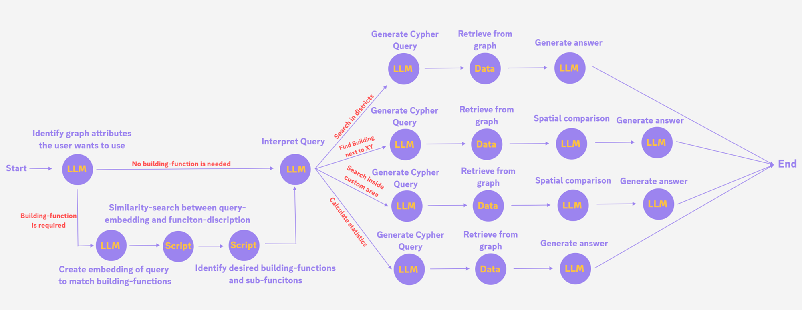
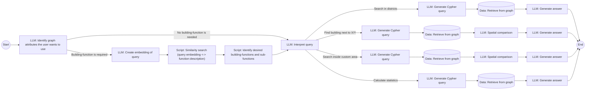

# Description of AX_Ploration Backend

## Agent architecture




---

# Implementation Documentation

## Overview

This backend implements a LangGraph-based agent system for querying ALKIS building data stored in Neo4j. The agent uses GPT-4o to understand natural language queries in German and converts them into Cypher queries to retrieve building information from the Berlin dataset.

## Architecture

The implementation follows a modular structure with:
- **Agent Workflow**: LangGraph state machine managing the query processing pipeline
- **Node Functions**: Individual processing steps (attribute identification, embedding search, query generation, etc.)
- **Utilities**: Neo4j client, LLM client, and prompt templates
- **Configuration**: Environment-based setup for API keys and database credentials

## Prerequisites

- Python 3.11+
- Neo4j Aura (or local Neo4j instance)
- OpenAI API Key
- Preprocessed Berlin ALKIS building data loaded into Neo4j

## Installation

1. **Clone the repository and navigate to the backend directory**:
   ```bash
   cd backend
   ```

2. **Install dependencies**:
   ```bash
   pip install langgraph langchain-openai neo4j python-dotenv openai
   ```

3. **Configure environment variables**:
   Rename the `.env.example` file in project root to `.env` and fillout all placeholders or create a `.env` file in the project root with:
   ```env
   OPENAI_API_KEY=your_openai_api_key_here
   NEO4J_URI=neo4j+s://your-instance.databases.neo4j.io
   NEO4J_USER=neo4j
   NEO4J_PASSWORD=your_password_here
   NEO4J_DATABASE=neo4j
   ```

## Database Schema

The Neo4j database contains the following structure:

### Node Labels

#### Building (198,201 nodes)
Properties:
- `id`: Unique building identifier (e.g., "DEBE00YY11100066")
- `centroid`: Point geometry representing building center (EPSG:25833)
- `floorAbove`: Number of floors above ground (integer)
- `houseNumber`: House number (string)
- `streetName`: Street name with house number (e.g., "Alter Wiesenweg 113")
- `geometryGeojson`: Building geometry as WKT MULTIPOLYGON (EPSG:25833)

#### BuildingFunction (234 nodes)
Properties:
- `code`: Function code (integer, e.g., 1000, 1010, 1020)
- `name`: Function name in German (e.g., "Wohngebäude", "Wohnhaus", "Wohnheim")

#### District (12 nodes)
Properties:
- `municipalityName`: District name (e.g., "Mitte", "Pankow", "Charlottenburg-Wilmersdorf")
- `municipalityKey`: District key
- `stateName`: State name ("Berlin")
- `stateKey`: State key
- `totalKey`: Total key
- `wkt`: District boundary geometry as WKT POLYGON
- `centroid`: District center point
- `gmlId`: GML identifier

### Berlin Districts
- Mitte
- Friedrichshain-Kreuzberg
- Pankow
- Charlottenburg-Wilmersdorf
- Spandau
- Steglitz-Zehlendorf
- Tempelhof-Schöneberg
- Neukölln
- Treptow-Köpenick
- Marzahn-Hellersdorf
- Lichtenberg
- Reinickendorf

**Important Notes**:
- No relationships exist between nodes
- Buildings have no direct `buildingFunction` property
- Buildings have no direct district reference
- Spatial queries are limited due to missing spatial functions for WKT strings in this Neo4j version
- Coordinates are in ETRS89/UTM zone 33N (EPSG:25833), not WGS84

## Project Structure

```
backend/
├── scripts/
│   ├── main.py                  # CLI entry point
│   ├── config.py                # Environment configuration
│   ├── models.py                # AgentState TypedDict definition
│   ├── graph.py                 # LangGraph workflow definition
│   ├── nodes/                   # Agent node implementations
│   │   ├── __init__.py
│   │   ├── attribute_identification.py
│   │   ├── embedding_search.py
│   │   ├── query_interpretation.py
│   │   ├── cypher_generation.py
│   │   ├── data_retrieval.py
│   │   ├── spatial_comparison.py
│   │   ├── answer_generation.py
│   │   └── routing.py
│   ├── utils/                   # Utility modules
│   │   ├── __init__.py
│   │   ├── neo4j_client.py     # Neo4j database client
│   │   ├── llm_client.py       # OpenAI LLM client
│   │   └── prompts.py          # Prompt templates
│   ├── test_components.py       # Component tests
│   └── export_schema.py         # Schema export utility
└── README.md                    # This file
```

## Usage

### Command Line Interface

Run queries from the command line:

```bash
# Basic query
python -m backend.scripts.main "Zeige mir alle Wohngebäude in Mitte"

# Verbose mode (shows processing steps)
python -m backend.scripts.main "Zeige mir alle Wohngebäude in Mitte" --verbose
```

### Programmatic Usage

```python
from backend.scripts.graph import run_agent

# Run a query
result = run_agent(
    query="Zeige mir alle Gebäude mit mehr als 5 Stockwerken",
    verbose=True
)

print(result["final_answer"])
```

## Agent Workflow

### 1. Attribute Identification
**Node**: `attribute_identification.py`

Analyzes the user query to identify:
- Which building attributes are being requested
- Whether a building function search is needed
- Hints about the desired building function

**Example**:
```
Query: "Zeige mir alle Wohngebäude in Mitte"
Output: {
    "attributes": ["municipalityName", "buildingFunction"],
    "needs_building_function": true,
    "building_function_hint": "Wohngebäude"
}
```

### 2. Embedding Search (Conditional)
**Node**: `embedding_search.py`

If a building function is needed:
1. Creates an embedding of the user's query
2. Performs vector similarity search against building function embeddings
3. Falls back to keyword matching if vector index is not available
4. Returns matching building function codes

**Example**:
```
Query hint: "Wohngebäude"
Output: [
    {"code": "1000", "name": "Wohngebäude"},
    {"code": "1010", "name": "Wohnhaus"},
    {"code": "1020", "name": "Wohnheim"}
]
```

### 3. Query Interpretation
**Node**: `query_interpretation.py`

Classifies the query type:
- `district`: Search in specific Berlin districts
- `nearby`: Find buildings near coordinates
- `custom_area`: Search within custom polygon/bbox
- `statistics`: Calculate statistics and aggregations

**Example**:
```
Query: "Zeige mir alle Wohngebäude in Mitte"
Output: {
    "query_type": "district",
    "reasoning": "Search for buildings in district Mitte"
}
```

### 4. Cypher Generation
**Node**: `cypher_generation.py`

Generates appropriate Cypher query based on query type:

**District Query Example**:
```cypher
MATCH (b:Building)
RETURN b.id, b.streetName, b.floorAbove, b.centroid
LIMIT 100
```

**Statistics Query Example**:
```cypher
MATCH (b:Building)
RETURN count(b) AS total, avg(b.floorAbove) AS avg_floors
```

### 5. Data Retrieval
**Node**: `data_retrieval.py`

Executes the Cypher query against Neo4j and returns results.

### 6. Spatial Comparison (Conditional)
**Node**: `spatial_comparison.py`

For `nearby` and `custom_area` queries:
- Performs spatial analysis on results
- Calculates distances
- Filters by spatial criteria

### 7. Answer Generation
**Node**: `answer_generation.py`

Generates a natural language answer in German based on:
- Original user query
- Retrieved data
- Spatial analysis (if applicable)

**Example Output**:
```
Es wurden 100 Gebäude gefunden:
- Durchschnittliche Stockwerke: 3.2
- Gebäude in Mitte: 45
- Gebäude in Pankow: 55
```

## Testing

Run the test suite:

```bash
python -m backend.scripts.test_components
```

Tests validate:
- Neo4j connection
- OpenAI API access
- LLM client functionality
- Agent state initialization
- Building function retrieval
- Cypher query generation
- Complete agent workflow

## Utilities

### Neo4j Client
**File**: `backend/scripts/utils/neo4j_client.py`

Singleton client for Neo4j operations:
- `execute_query(query, params)`: Execute Cypher queries
- `verify_connection()`: Test database connection
- `get_building_functions()`: Retrieve all building functions
- `similarity_search(embedding, top_k)`: Vector similarity search (if index exists)

### LLM Client
**File**: `backend/scripts/utils/llm_client.py`

Wrapper for OpenAI API:
- `chat(messages, temperature, max_tokens)`: Chat completion
- `json_chat(messages, temperature)`: JSON-mode completion
- `create_embedding(text, model)`: Create text embeddings

### Prompts
**File**: `backend/scripts/utils/prompts.py`

Centralized prompt templates with schema documentation for:
- Attribute identification
- Query interpretation
- Cypher generation (district, nearby, custom_area, statistics)
- Answer generation

## Limitations

1. **No Direct Building Function Filter**: Buildings don't have a `buildingFunction` property, limiting function-based filtering
2. **No Spatial Relationships**: No direct building-to-district relationships; spatial queries are limited
3. **Coordinate System**: Data uses EPSG:25833, not WGS84
4. **Vector Search**: May not be available if vector index is not configured
5. **Result Limit**: Queries are limited to 100 results for performance

## Troubleshooting

### Connection Issues
```bash
# Test Neo4j connection
python -c "from backend.scripts.utils.neo4j_client import neo4j_client; print(neo4j_client.verify_connection())"
```

### Schema Export
```bash
# Export current database schema
python -m backend.scripts.export_schema
```

### Verbose Mode
Use `--verbose` flag to see detailed processing steps:
```bash
python -m backend.scripts.main "your query" --verbose
```
